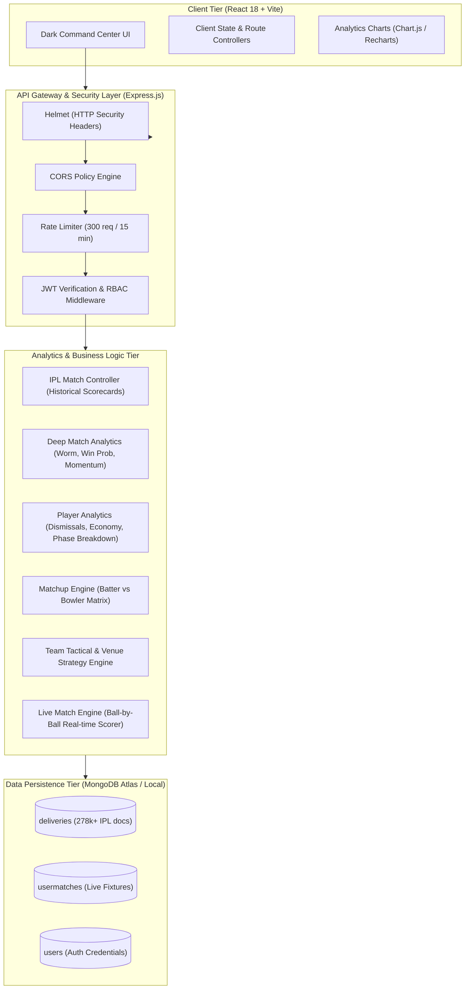

# 🏏 Cricket Intelligence System
### Production-Grade Full-Stack Cricket Match Intelligence & Quantitative Sports Analytics Platform

[](https://nodejs.org/)
[](https://expressjs.com/)
[](https://www.mongodb.com/)
[](https://react.dev/)
[](https://vitejs.dev/)
[](https://helmetjs.github.io/)

---

## 📌 Executive Summary

The **Cricket Intelligence System** is an end-to-end sports data analytics platform engineered for data engineers, tactical analysts, and cricket franchises. It unifies **278,000+ historical ball-by-ball IPL deliveries** with a **real-time live match scoring engine**, translating raw delivery telemetry into actionable performance indicators, match momentum trajectories, batter-vs-bowler matchups, and in-game win probability curves.

Engineered with a **MERN stack** (MongoDB, Express.js, React 18, Node.js) and adhering to strict software craftsmanship principles, this platform illustrates core competencies relevant to enterprise data consultancies like **Deloitte IT Data & Analytics**:
- **High-Throughput Aggregation Pipelines**: Multi-stage MongoDB aggregation pipelines with compound indexing across 60+ delivery attributes.
- **Quantitative Formula Rigor**: Defensible metrics including dismissal-based batting averages, valid-ball adjusted economy rates, logistic win probability modeling, and normalized pressure indices.
- **Enterprise Security & Reliability**: Hardened Express API with `helmet`, IP rate limiting, strict CORS whitelisting, centralized error handling, and robust Mongoose schema typing.
- **Professional Command-Center UI**: Custom-tailored dark analytical design system built using CSS Custom Properties and CSS Modules without third-party utility clutter.

---

## 🏗️ Architecture & System Topology



---

## 📊 Dual-Layer Data Architecture

The platform operates across two synergistic data layers:

1. **Historical Telemetry Layer (`deliveries` collection)**:
   - Contains **278,000+ ball-by-ball IPL records** spanning multiple tournament seasons.
   - Captures granular data: pitch venue, match dates, toss decisions, innings, over, ball number, batter, bowler, batter runs, extra types (wides, no-balls, leg-byes), dismissal modes, and fielder involvements.
   - Indexed on `{ match_id: 1, innings: 1, ball_no: 1 }`, `{ batter: 1 }`, and `{ bowler: 1 }` for sub-10ms aggregation execution.

2. **User & Live Match Engine Layer (`usermatches` & `users` collections)**:
   - Supports custom tournament management and real-time live scoring.
   - Employs an event-driven ball-by-ball state machine maintaining live striker, non-striker, over progression, strike rotation, bowler over restrictions, and match conclusion logic.

---

## 📐 Quantitative Formulations & Analytics Rigor

Every analytical metric in this system is computed with statistical precision to ensure interview readiness and analytical defensibility:

### 1. Batting Average vs Strike Rate
* **Batting Average**:
  $$\text{Batting Average} = \frac{\sum \text{Runs Scored}}{\sum \text{Dismissals}}$$
  *Implementation Note*: Traditional rookie errors divide total runs by ball count. Our engine checks dismissal occurrences (`player_out === batter`). If dismissals = 0, the system outputs the total runs with a descriptive not-out flag.
* **Strike Rate (SR)**:
  $$\text{Strike Rate} = \left(\frac{\sum \text{Runs Batter}}{\sum \text{Valid Balls Faced}}\right) \times 100$$
  *Implementation Note*: Excludes wides from balls faced in strict compliance with official ICC/IPL playing conditions.

### 2. Bowling Economy & Bowling Average
* **Economy Rate (Econ)**:
  $$\text{Economy Rate} = \left(\frac{\sum \text{Runs Conceded by Bowler}}{\sum \text{Valid Balls Bowled}}\right) \times 6$$
  *Implementation Note*: Excludes leg-byes and byes from the bowler's runs conceded, while accurately tallying wides and no-balls as bowler penalties.
* **Bowling Average**:
  $$\text{Bowling Average} = \frac{\sum \text{Runs Conceded}}{\sum \text{Wickets Taken}}$$

### 3. Match Pressure Index (PI)
$$\text{Pressure Index} = \frac{\text{Wickets Fallen} \times 10}{\text{Overs Bowled} + 1}$$
* *Analytical Rationale*: Quantifies the fielding team's chokehold on the batting side. The $+1$ denominator smoothing prevents division by zero in the opening over while normalizing the rate of wicket degradation over innings duration.

### 4. Match Intensity Classification
Measures the competitiveness of a match based on the absolute run difference ($\Delta R$) between the teams:
- **Very Close**: $\Delta R \le 10$ runs (High-leverage finish)
- **Competitive**: $10 < \Delta R \le 30$ runs (Balanced fixture)
- **One Sided**: $\Delta R > 30$ runs (Dominant performance)

### 5. In-Game Win Probability Model (Live Chasing Curve)
For the chasing team in Innings 2, win probability is computed ball-by-ball via a weighted logistic response function:
$$P(\text{Win}) = \frac{1}{1 + e^{-k \cdot (R_{\text{ratio}} - 1)}} \times \left(\frac{W_{\text{left}}}{10}\right)^{\alpha}$$
Where:
- $R_{\text{ratio}} = \frac{\text{Current Run Rate}}{\text{Required Run Rate}}$
- $W_{\text{left}}$ represents wickets in hand ($10 - \text{wickets fallen}$).
- Boundary conditions: $P(\text{Win}) = 100\%$ when Target is breached; $P(\text{Win}) = 0\%$ when balls expire or 10 wickets fall.

---

## 🛠️ Technology Stack

| Layer | Technologies | Key Libraries & Rationale |
|---|---|---|
| **Frontend** | React 18, Vite | React Router DOM, Chart.js, Recharts, Lucide Icons |
| **Styling** | Vanilla CSS / CSS Modules | Strict custom properties design system, dark command-center aesthetic, glassmorphism, responsive CSS Grid |
| **Backend** | Node.js (ESM), Express.js | Helmet (CSP/HSTS headers), CORS whitelisting, Express Rate Limit, JWT |
| **Database** | MongoDB 6+ | Mongoose 8+, multi-stage `$facet` & `$group` aggregation pipelines |
| **Data Ingestion**| Python / Node Stream | Streaming CSV parser for 278K+ record batch import |

---

## 🔌 API Reference Catalog

### 1. Historical IPL Analytics (`/api/matches`)
- `GET /api/matches`: Lists historical matches sorted chronologically with match summaries.
- `GET /api/matches/:matchId`: Full match scorecard, fall of wickets, bowler figures, and innings telemetry.
- `GET /api/matches/analytics`: Global tournament-wide KPIs (total matches, average run rates per innings, dominant matches).
- `GET /api/matches/:matchId/deep`: Deep match intelligence: Over-by-over Worm chart, In-game Win Probability curve, Momentum Tracker, and Key Match Turning Points (Wicket clusters, Big overs).

### 2. Player Intelligence (`/api/players`)
- `GET /api/players/batting`: Top run-scorers, batting averages, strike rates, fours, sixes.
- `GET /api/players/bowling`: Top wicket-takers, economy rates, average, strike rates.
- `GET /api/players/:playerName`: Complete biographical and career performance card (phase-wise breakdown: Powerplay, Middle, Death overs).

### 3. Matchups & Strategy (`/api/matchups`, `/api/strategy`, `/api/compare`)
- `GET /api/matchups?batter=...&bowler=...`: Head-to-head batter vs bowler matrix (balls, runs, dismissals, strike rate, dot ball percentage).
- `GET /api/strategy/:teamName`: Franchise tactical dossier (win percentage when batting first vs second, top venues, phase strengths).
- `GET /api/venues`: Venue statistics (average first-innings score, toss impact on match outcome).
- `GET /api/compare/players?p1=...&p2=...`: Multi-attribute comparative analysis between two batsmen or bowlers.

### 4. Match Engine & Auth (`/api/auth`, `/api/live`)
- `POST /api/auth/register`: User signup with bcrypt password hashing and JWT issuance.
- `POST /api/auth/login`: User login returning HTTP-only bearer token.
- `POST /api/live/create`: Initialize custom fixture with custom teams, players, and total overs.
- `POST /api/live/:matchId/ball`: Record single delivery event (runs, extras, wicket type) with real-time state mutation.

---

## 🔒 Security & Quality Engineering

1. **Security Headers**: `helmet` enforces strict HTTP headers (Content Security Policy, X-Frame-Options, DNS Prefetch Control, Referrer Policy).
2. **Denial of Service Prevention**: `express-rate-limit` throttles IP requests to 300 requests per 15-minute window.
3. **Payload Sanitization**: Request bodies restricted to 10kb to avert buffer overflow exploits.
4. **Environment Isolation**: Multi-stage `.gitignore` protecting secret variables (`.env`, `*.env`) and raw ingestion datasets.
5. **Memory-Safe Aggregations**: Aggregation queries leverage `.lean()` and projected `$project` stages to reduce Node.js heap memory footprints.

---

## 🚀 Setup & Installation Guide

### Prerequisites
- **Node.js**: v18.0.0 or higher
- **MongoDB**: Community Server v6+ or MongoDB Atlas URI
- **Git**

### 1. Clone Repository
```bash
git clone https://github.com/aayush45123/Cricket-Intelligence.git
cd cricket-intelligence
```

### 2. Configure Environment Variables
Create a `.env` file in the `server` directory:
```env
PORT=5000
MONGO_URI=mongodb://127.0.0.1:27017/cricket_intelligence
JWT_SECRET=your_super_secret_jwt_key_here
CLIENT_URL=http://localhost:5173
```

### 3. Install Dependencies
```bash
# Install Server Dependencies
cd server
npm install

# Install Client Dependencies
cd ../client
npm install
```

### 4. Data Ingestion (Optional for Historical IPL Data)
If populating historical ball-by-ball IPL data:
```bash
cd ../data-import
# Run MongoDB import for deliveries collection
mongoimport --db cricket_intelligence --collection deliveries --type csv --headerline --file IPL.csv
```

### 5. Launch Development Servers
**Terminal 1 (Backend API)**:
```bash
cd server
npm run dev
# Server listening at http://localhost:5000
```

**Terminal 2 (Frontend Client)**:
```bash
cd client
npm run dev
# Application accessible at http://localhost:5173
```

---

## 💼 Interview Showcase Highlights (For Deloitte IT Data & Analytics)

When discussing this project during technical and managerial interviews, focus on these engineering decisions:

1. **Handling Incomplete / Dirty Data in Sports Telemetry**:
   * *Problem*: In cricket ball-by-ball logs, wides do not count towards balls faced by the batsman, and leg-byes do not count against the bowler's economy.
   * *Solution*: Designed compound aggregation pipelines filtering `valid_ball === 1` for balls faced while maintaining `runs_total` for match momentum.

2. **Scalability of Aggregation Pipelines on 278,000+ Documents**:
   * *Problem*: Computing career stats across millions of deliveries on demand can cause query timeouts.
   * *Solution*: Implemented compound indexes on `(batter, valid_ball)` and utilized `$facet` stages to calculate runs, dismissals, and boundary breakdowns in a single database round-trip.

3. **Real-time State Machine for Live Scoring**:
   * *Problem*: Cricket match scoring involves interdependent edge cases (over changes, free hits, strike rotation on odd runs, fall of wickets).
   * *Solution*: Built a deterministic controller layer enforcing strict validation before updating match documents in MongoDB.

---

## 📄 License
This project is licensed under the MIT License — see the [LICENSE](LICENSE) file for details.
